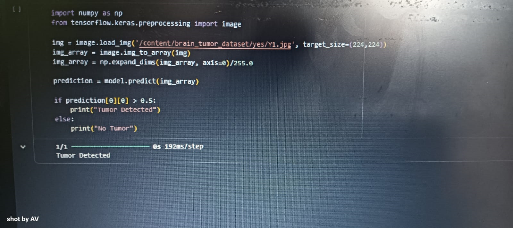

Check out the configuration reference at https://huggingface.co/docs/hub/spaces-config-reference
## Model File

The trained deep learning model (.h5) file is large (287MB),
so it is stored in Google Drive.

Download Model:
https://drive.google.com/file/d/10NYht-ThtZZUefJHyYo7pQvWWoMKPzmR/view?usp=sharing

## Project Description

This project detects diseases from medical images using Deep Learning.

Diseases Detected:
- Brain Tumour
- Skin Cancer
- Pneumonia

Live Demo:
https://huggingface.co/spaces/DadiLakshmiSaiAnusha/medical-image-disease-detector

## Contribution

Contributed by Pravallika Devi:
- Model Testing
- Output Verification
- Documentation Update
- Model File Integration

## Model Training Result

Below is the screenshot showing model training and prediction result.

